API Gateway support Cognito OAuth scopes for method level authorization. A scope defines the level of access to a resource that an application has permission to. In this document we are presenting authentication and authorization solution for API Gateway using custom authorizer. Lambda custom authorization will validate OAuth scopes and Cognito username/password for applications that does not support OAuth scopes. After validation based on authorization metadata in Dynamo DB it will allow API invoker to call specific method/resource. 

## Solution

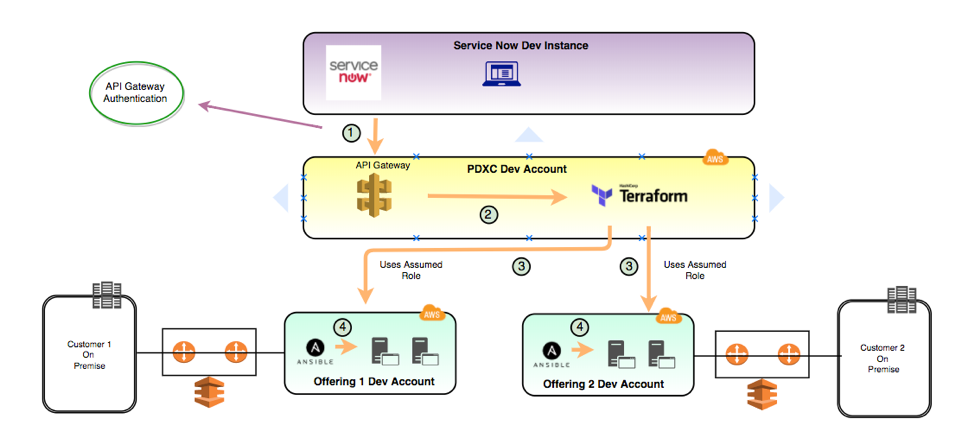
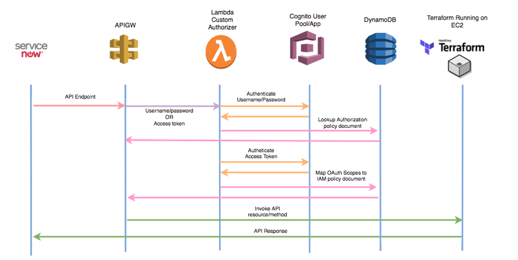

### Create Cognito User Pool

Enter pool name and click on Step through settings. Accept default until you reach Review section and then Click on create pool.

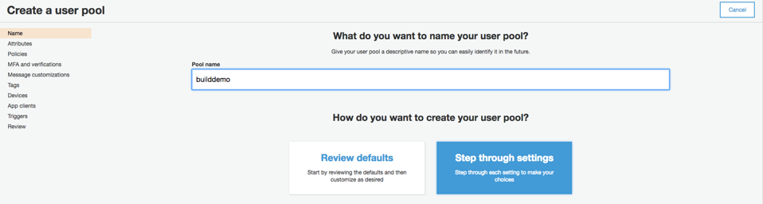

Create domain.

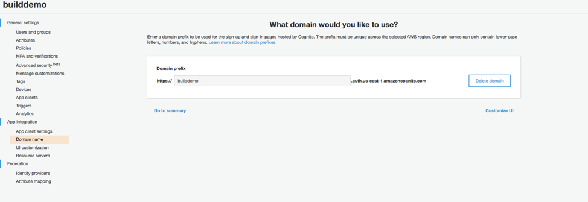

Create Resource server

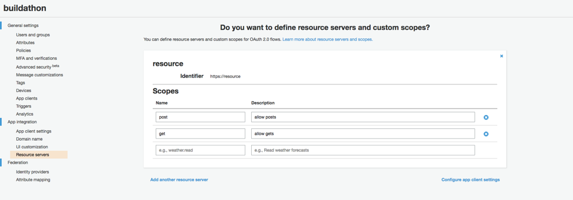

Click on App clients.

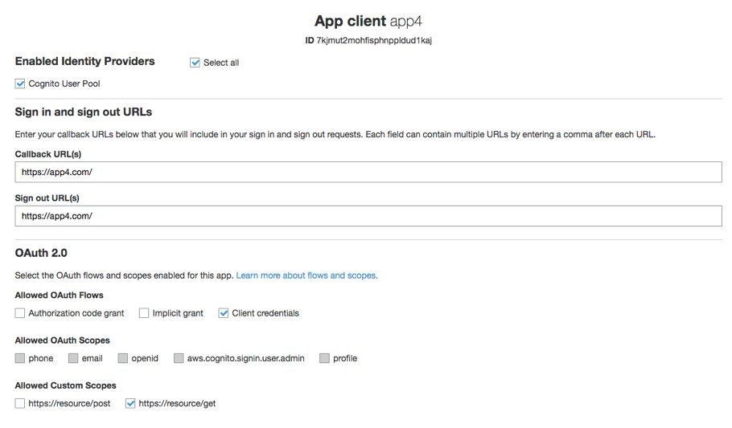

Create two application users and authenticate them using AWS CLI commands as shown below.

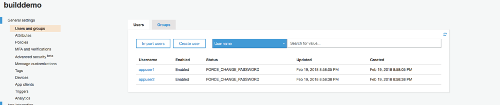

*aws cognito-idp admin-initiate-auth --user-pool-id <userpool id> --client-id <client_id> --auth-flow ADMIN_NO_SRP_AUTH --auth-parameters USERNAME=<username>,PASSWORD=<password>*

*aws cognito-idp admin-respond-to-auth-challenge --user-pool-id <userpool id> --client-id <client_id> --challenge-name NEW_PASSWORD_REQUIRED --challenge-responses NEW_PASSWORD=<password>,USERNAME=<username> --session <session id from above command output>*

Users should have status confirmed after running above commands.

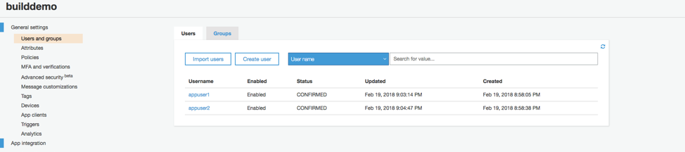


### Create Lambda function for API custom authorizer.

Use code from Appendix A4

### Create table in DyanmoDB and update authorization metadata.

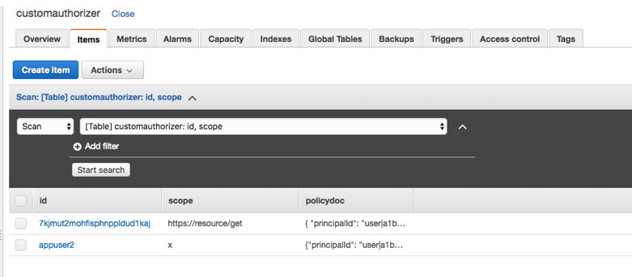

Policy document in appendix A5.

### API Gateway Setup

Create new Authorizer for API Gateway using lambda function created in previous step.

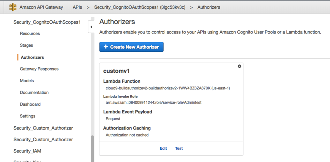

### Testing:

Cognito User is authorized to call read/GET resource/method.

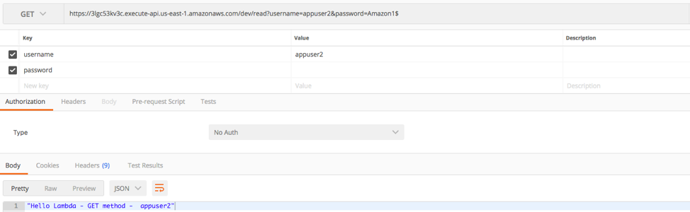
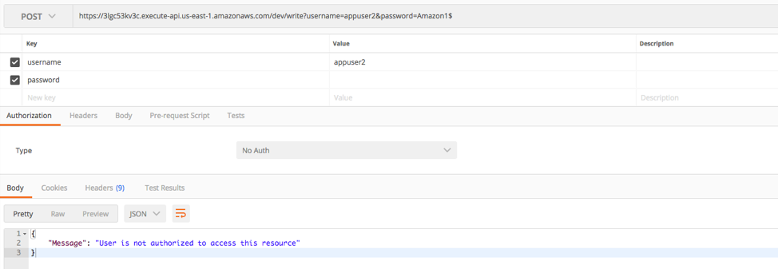

Cognito App client id is authorized to call write/POST resource/method.

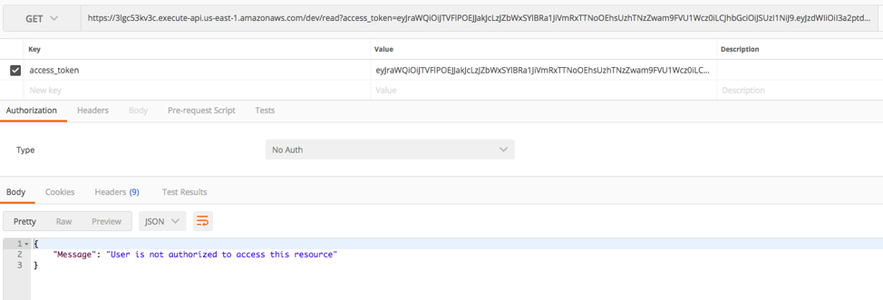
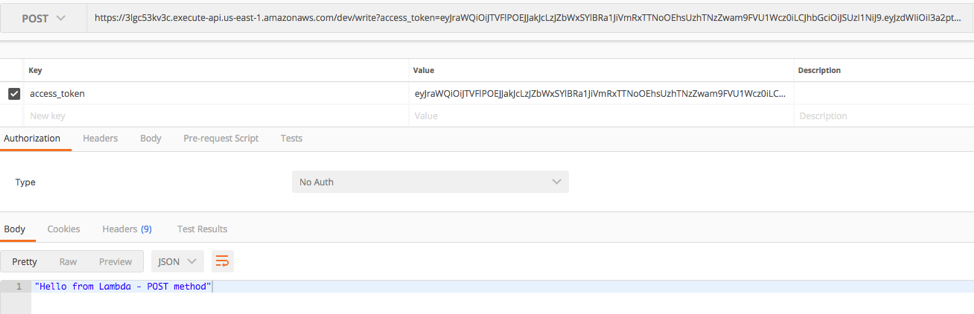

## Appendix:

### A1. Sample Terraform to create Cognito resources.

File: varibles.tf

```
variable "aws_region" {
  description = "AWS region to launch servers."
  default     = "us-east-1"
}


variable "create_resource_server_file" {
  description = "json input for create resource server"
  default     = "file:///Users/username/Downloads/terra/create-resource-server.json"
}

variable "create_user_pool_client_file" {
  description = "json input for create resource server"
  default     = "file:///Users/username/Downloads/terra/create-user-pool-client.json"
}
```

File: main.tf

```
provider "aws" {
   region = "${var.aws_region}"
}

resource "aws_cognito_user_pool" "pool" {
  name = "mycognitopool1"
}


resource "null_resource" "aws_cognito_create_resource_server" {
provisioner "local-exec" {
    command = <<EOF
    aws cognito-idp create-resource-server --user-pool-id ${aws_cognito_user_pool.pool.id} --cli-input-json ${var.create_resource_server_file}
    EOF
    }
}

resource "aws_cognito_user_pool_domain" "main" {
  domain = "mycogpool1"
  user_pool_id = "${aws_cognito_user_pool.pool.id}"
}


resource "null_resource" "aws_cognito_create_user_pool_client" {
provisioner "local-exec" {
    command = <<EOF
    aws cognito-idp create-user-pool-client --user-pool-id ${aws_cognito_user_pool.pool.id} --cli-input-json ${var.create_user_pool_client_file}
    EOF
    }
}
```

File: create-user-pool-client.json

```
{
    "UserPoolId": "",
    "ClientName": "validate",
    "GenerateSecret": false,
    "RefreshTokenValidity": 0,
    "ExplicitAuthFlows": [
        "ADMIN_NO_SRP_AUTH",
        "USER_PASSWORD_AUTH"
    ],
    "SupportedIdentityProviders": [
        "COGNITO"
    ],
    "CallbackURLs": [
        "https://validate.com/"
    ],
    "LogoutURLs": [
        "https://validate.com/"
    ],
    "AllowedOAuthFlows": [
        "code"
    ],
    "AllowedOAuthScopes": [
        "https://resource1/get",
        "https://resource1/post"
    ],
    "AllowedOAuthFlowsUserPoolClient": true
}
```

File: create-resource-server.json

```
{
    "UserPoolId": "",
    "Identifier": "https://resource1",
    "Name": "resource",
    "Scopes": [
        {
            "ScopeName": "get",
            "ScopeDescription": "allow gets"
        },
        {
            "ScopeName": "post",
            "ScopeDescription": "allow posts"
        }
    ]
}
```

## A2. API Gateway Swagger template

```
---
swagger: "2.0"
info:
  version: "2018-03-21T17:11:25Z"
  title: "Security_CognitoOAuthScopes1"
host: "3lgc533c.execute-api.us-east-1.amazonaws.com"
basePath: "/dev"
schemes:
- "https"
paths:
  /read:
    get:
      consumes:
      - "application/json"
      produces:
      - "application/json"
      parameters:
      - name: "access_token"
        in: "query"
        required: false
        type: "string"
      - name: "password"
        in: "query"
        required: false
        type: "string"
      - name: "username"
        in: "query"
        required: false
        type: "string"
      responses:
        200:
          description: "200 response"
          schema:
            $ref: "#/definitions/Empty"
      security:
      - customv1: []
      x-amazon-apigateway-integration:
        responses:
          default:
            statusCode: "200"
        requestParameters:
          integration.request.querystring.password: "method.request.querystring.password"
          integration.request.querystring.access_token: "method.request.querystring.access_token"
          integration.request.querystring.username: "method.request.querystring.username"
        uri: "arn:aws:apigateway:us-east-1:lambda:path/2015-03-31/functions/arn:aws:lambda:us-east-1:xxxx:function:HelloRead/invocations"
        passthroughBehavior: "when_no_templates"
        httpMethod: "POST"
        requestTemplates:
          application/json: "{\n    \"access_token\" : \"$input.params('access_token')\"\
            ,\n    \"username\" : \"$input.params('username')\",\n    \"password\"\
            \ : \"$input.params('password')\"\n}"
        contentHandling: "CONVERT_TO_TEXT"
        type: "aws"
  /write:
    post:
      consumes:
      - "application/json"
      produces:
      - "application/json"
      parameters:
      - name: "access_token"
        in: "query"
        required: false
        type: "string"
      - name: "password"
        in: "query"
        required: false
        type: "string"
      - name: "username"
        in: "query"
        required: false
        type: "string"
      responses:
        200:
          description: "200 response"
          schema:
            $ref: "#/definitions/Empty"
      security:
      - customv1: []
      x-amazon-apigateway-integration:
        responses:
          default:
            statusCode: "200"
        requestParameters:
          integration.request.querystring.password: "method.request.querystring.password"
          integration.request.querystring.access_token: "method.request.querystring.access_token"
          integration.request.querystring.username: "method.request.querystring.username"
        uri: "arn:aws:apigateway:us-east-1:lambda:path/2015-03-31/functions/arn:aws:lambda:us-east-1:xxxx:function:HelloWrite/invocations"
        passthroughBehavior: "when_no_templates"
        httpMethod: "POST"
        requestTemplates:
          application/json: "{\n    \"access_token\" : \"$input.params('access_token')\"\
            ,\n    \"username\" : \"$input.params('username')\",\n    \"password\"\
            \ : \"$input.params('password')\"\n}"
        contentHandling: "CONVERT_TO_TEXT"
        type: "aws"
securityDefinitions:
  customv1:
    type: "apiKey"
    name: "Unused"
    in: "header"
    x-amazon-apigateway-authtype: "custom"
    x-amazon-apigateway-authorizer:
      authorizerCredentials: "arn:aws:iam::xxxx:role/service-role/Admintest"
      authorizerUri: "arn:aws:apigateway:us-east-1:lambda:path/2015-03-31/functions/arn:aws:lambda:us-east-1:xxxx:function:cloud9-buildauthorizev2-buildauthorizev2-abc/invocations"
      authorizerResultTtlInSeconds: 0
      type: "request"
definitions:
  Empty:
    type: "object"
    title: "Empty Schema"
```


